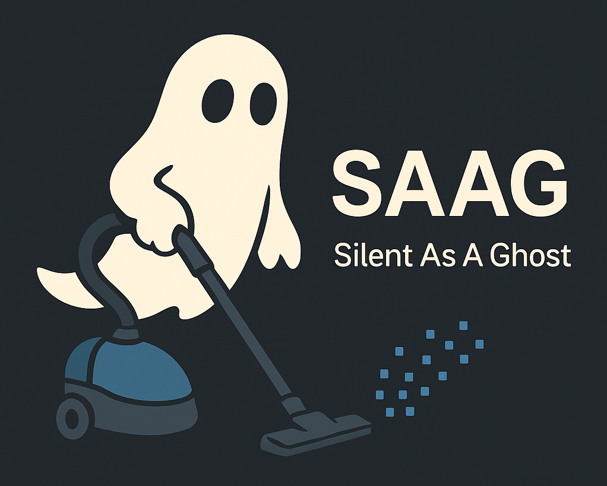

# SAAG (Silent as a Ghost)

## Intro

Be honest, we both know what we are aiming to... 🤡

## Roadmap

- [ ] Identify all predictable paths containing sensitive data
- [ ] Implement efficient compression for collected data
- [ ] Use SSH for secure data transfer
- [ ] Explore unpredictable paths for additional sensitive data
- [ ] Remove all traces to cover tracks after completion